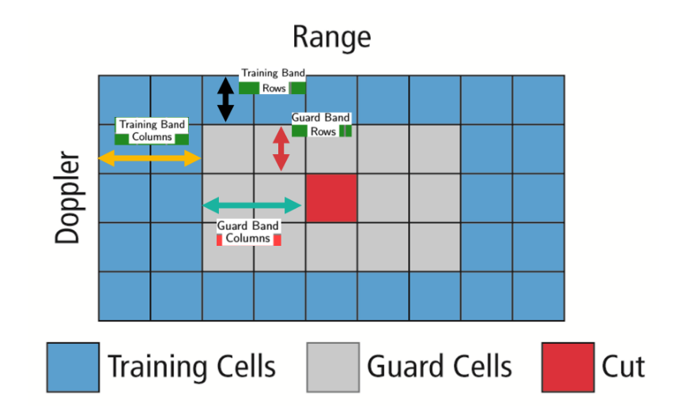
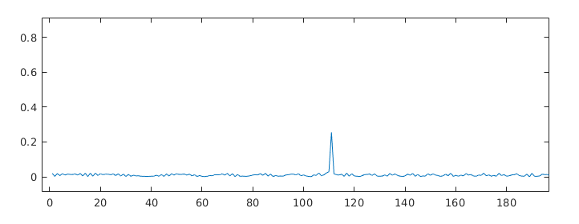
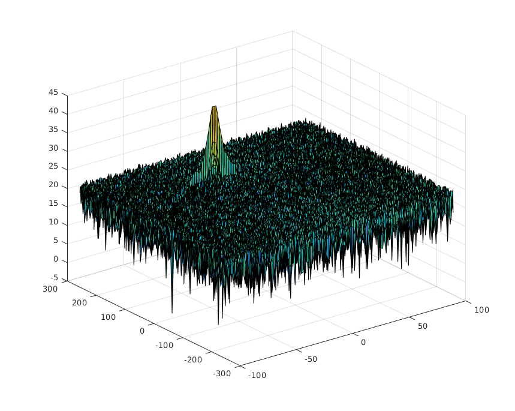
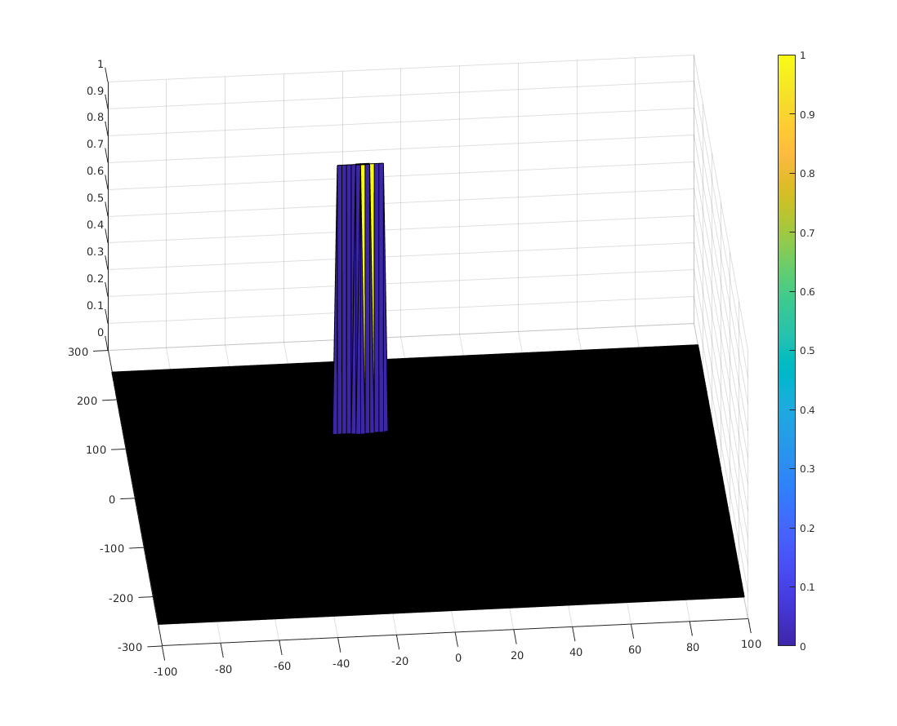

# SFND_radar_target
**Radar Target Generation and Detection Project**
---

## Dependencies
* Matlab >= R2018b (to run the Matlab version of the program)
* Python >= 3.6 with matplotlib and numpy (to run the Python version of the program)

Tested under Ubuntu 18.04.

## Running Instructions

1. Clone this repo
2. Matlab: load and run `radar_target_generation_and_detection.m` from the root of the repo
3. Python: in the root of the repo type `python radar.py`

## Implementation Notes

The CFAR is a matrix with the *same size* as the range doppler map (RDM), initialized to all 0s at the beginning of the computation. 

To compute the CFAR, I slide a window across the range doppler map (RDM), in such a way that the window is always entirely within the RDM. The window has `2*(Td+Gd)+1` rows and `2*(Tr+Gr)+1` columns. See picture below. 

 

Parameters are set to:
```
Training Band
Tr = 8  # Training range -> columns
Td = 4  # Training doppler -> rows

Guard Band
Gr = 4  # Guard range -> columns
Gd = 2  # Guard doppler -> rows
```

For every position of the window, I compute the average of the RDM cells that coincide with the training band of the window. This average is the noise level, which I increase by a given offset (5 dB), and then use to threshold the cell of the RDM that falls in the centre of the window (the CUT -Cell Under Test).

At the end of the process, all the cells of the CFAR matrix have been computed (all cells of the RDM matrix have been thresholded), except those less than `Tr-Gr` positions from either side, or less than `Td-Gd` positions from the top or bottom. *Those cells were already set to 0 before beginning to slide the window, and the resulting CFAR matrix is already the same size as the RDM, no further processing is needed.*

In the picture below, the result of applying a FFT to the signal. The peak corresponds to the target at 110m distance.



The range doppler map (RDM), obtained with a 2D FFT.



The output of CA-CFAR.


    
 
 ## Credits
 
  Matlab code based on the skeleton provided by Udacity as part of the Sensor Funsion Nanodegree Program. Picture of the sliding window provided by the same. 